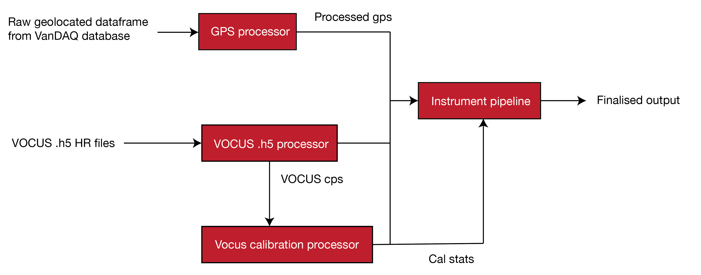
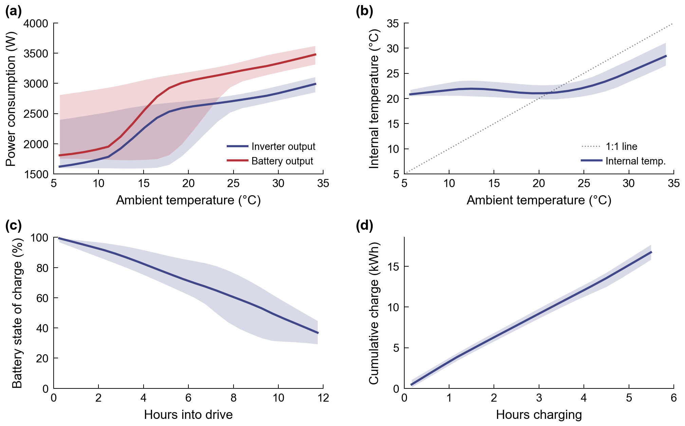
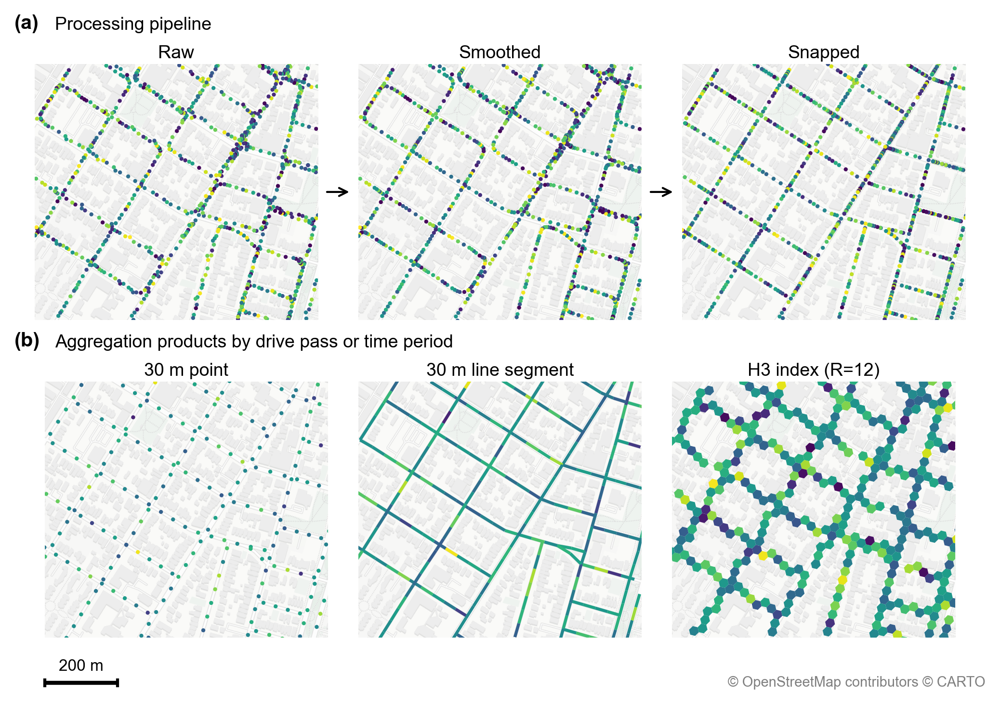

# CalMAPLab Unified Data Processing Pipeline

The unified workflow for processing mobile air quality monitoring data from the CalMAPLab platform.

## Overview

This pipeline integrates four CalMAPLab processing stages into a single coordinated workflow:



### Pipeline Stages

1. **GPS Pipeline** (`gps_pipeline.py`)
   - Loads raw GPS data from VanDAQ raw drive file
   - Applies Kalman smoothing with RTS smoother
   - Downloads/caches road network from OpenStreetMap
   - Matches GPS points to road segments (direction-aware)
   - Calculates drive passes
   - Outputs GeoParquet with segment geometries

2. **VOCUS H5 Pipeline** (`vocus_h5_processor.py`)
   - Loads raw VOCUS PTR-ToF-MS HR-integrated .h5 files 
   - Converts counts-per-extraction to counts-per-second
   - Extracts timestamps and valve states
   - Outputs processed Parquet files

3. **VOCUS Calibration Pipeline** (`vocus_calibration.py`)
   - Identifies calibration windows
   - Computes Deming regression for each species
   - Estimates k_PTR sensitivity relationships
   - Processes in-drive zero measurements
   - Generates diagnostic plots

4. **Instrument Pipeline** (`instrument_pipeline.py`)
   - Loads VanDAQ drive file and VOCUS cps data
   - Applies instrument-specific lag corrections
   - Flags data based on QC thresholds
   - Joins with processed GPS data
   - Applies calibrations (slope/intercept interpolation)
   - Generates finalised output files

## Installation

### Dependencies

```bash
pip install pandas numpy scipy geopandas shapely h5py pyarrow numba requests pyyaml matplotlib
```

### File Structure

Place all pipeline modules and configuration file into your Python path:
```
project/
├── calmaplab_pipeline.py    # Unified orchestrator
├── gps_pipeline.py          # GPS processing
├── vocus_h5_processor.py    # VOCUS H5 processing
├── vocus_calibration.py     # VOCUS calibration
├── instrument_pipeline.py   # Instrument processing
└── config.yaml              # Your configuration
```

## Configuration

### YAML Configuration File

Create a `config.yaml` file (see example for template):

```yaml
paths:
  base_raw: "/data/calmap/raw"
  base_processed: "/data/calmap/processed"
  cal_standards: "/ref/calibration_standards.csv"
  # ... other paths

config:
  org: "UCB"
  revision: "r1"
  cal_cylinder_no: "CC524064"
  # ... other settings
```

### Path Configuration

| Path | Description | Required For |
|------|-------------|--------------|
| `gps_raw` | Raw VanDAQ geolocated drive output files | GPS stage |
| `gps_processed` | Processed GPS output | GPS, Instrument |
| `vocus_h5_raw` | Raw VOCUS .h5 files | VOCUS H5 stage |
| `vocus_cps` | Processed CPS files | VOCUS H5, Cal, Instrument |
| `cal_standards` | Calibration cylinder concentrations | VOCUS Cal |
| `peak_columns` | VOCUS peak column names CSV | VOCUS H5 |
| `tps_columns` | VOCUS TPS column names CSV | VOCUS H5 |
| `flags_file` | QC flag thresholds | Instrument |
| `lag_times` | Instrument lag times | Instrument |
| `aclima_fields` | Field name mappings | Instrument |

### Processing Configuration

| Parameter | Default | Description |
|-----------|---------|-------------|
| `kalman_process_noise` | 1e-9 | Kalman filter process noise |
| `kalman_measurement_noise` | 1e-10 | Kalman filter measurement noise |
| `segment_length_m` | 30 | Road segment length (meters) |
| `max_match_distance_m` | 15 | Max GPS-to-road matching distance |
| `cal_cylinder_no` | - | Active calibration cylinder ID |
| `default_k` | 2.5 | Default k_PTR value |
| `ptr_prefixes` | "HCOKSNV" | Regex prefixes for PTR ions |


## How to run
### All stages

```python
from calmaplab_pipeline import CalMAPLabPipeline

pipeline = CalMAPLabPipeline.from_yaml("config.yaml")
results = pipeline.run("2026-01-30")
```

### Individual Stages

```python
from calmaplab_pipeline import ProcessingStage

# Run only GPS and VOCUS H5 stages
results = pipeline.run(
    "2025-07-15",
    stages=[ProcessingStage.GPS, ProcessingStage.VOCUS_H5]
)

# Run only calibration (assumes VOCUS CPS files exist)
results = pipeline.run(
    "2025-07-15",
    stages=[ProcessingStage.VOCUS_CAL]
)
```

## Output Files

### GPS Stage
- `processed_gps_{date}.parquet` - GeoParquet with road-matched GPS

### VOCUS H5 Stage
- `{date}_cps.parquet` - Long-format Parquet for pipeline integration

### VOCUS Calibration Stage
- `{date}_calstats.csv` - Calibration statistics (slopes, intercepts)
- `{date}_zeros.csv` - In-drive zero measurements
- `{date}_curves.pdf` - Diagnostic calibration curves
- `{date}_ksens.pdf` - k_PTR sensitivity plot

### Instrument Stage
- `UCB_complete_{date}_L2a_r1.csv` - Full 1Hz calibrated data
- `UCB_{date}_L2a_r1.csv` - Aclima-format L2 output for SMMI project
- `{date}_targets.csv` - Target calibration results

## Figure reproduction

Manuscript figures can be regenerated from curated inputs in `data/figure_inputs/` without the full campaign dataset. After cloning, fetch Git LFS objects first:

```bash
git lfs pull
```

Additional figure dependencies:

```bash
pip install statsmodels contextily h3 pyproj
```

### Bundled inputs

| File | Size | Used by |
|------|------|---------|
| `data/figure_inputs/electrical_performance/victron/*.csv` (3 files) | ~71 MB (Git LFS) | Electrical performance figure |
| `data/figure_inputs/electrical_performance/amb_temp_5min.parquet` | ~200 KB | Electrical performance figure |
| `data/figure_inputs/gps/processed_gps_2025-10-08_bbox.parquet` | ~110 KB | GPS processing figure |

Full pipeline outputs (`data/processed/`, `data/raw/`, DuckDB) remain external and are not required for these figures.

### Electrical performance



```bash
python manuscript/electrical_performance.py
```

Outputs `figures/electrical_performance.{pdf,png}`.

To re-derive ambient temperature from full L2 parquets instead of the bundled file:

```bash
python manuscript/electrical_performance.py --data-dir data/processed/complete
```

### GPS processing pipeline



```bash
python manuscript/gps_processing_visualisation.py
```

Outputs `figures/gps_processing_pipeline_vis.{pdf,png}`. Requires network access for CartoDB basemap tiles via `contextily`.

## Extending the Pipeline

### Adding Custom Stages

```python
from calmaplab_pipeline import CalMAPLabPipeline, ProcessingStage

class ExtendedPipeline(CalMAPLabPipeline):
    def run_custom_stage(self, date_str: str):
        # Your custom processing
        pass
    
    def run(self, date_str, stages=None, **kwargs):
        results = super().run(date_str, stages, **kwargs)
        
        # Add custom stage
        if self.should_run_custom_stage:
            results['stages']['custom'] = self.run_custom_stage(date_str)
        
        return results
```

## License

Licensed under the BSD 3-Clause License (see LICENSE).